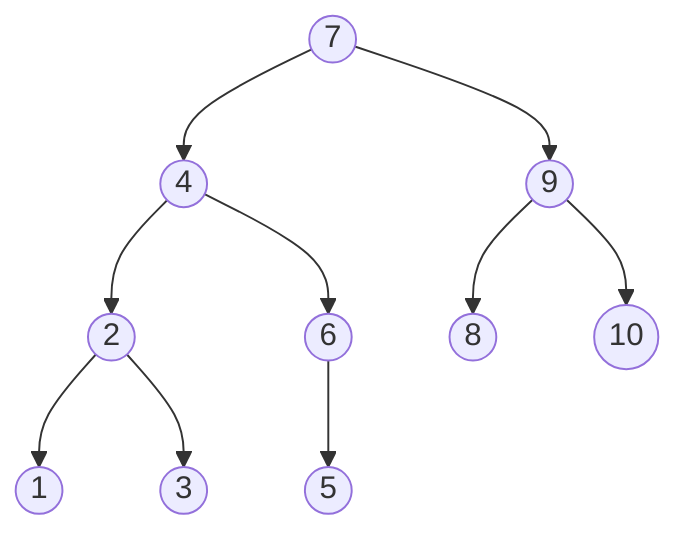

# inorder_traversal_binary_tree

Write a function that takes an array of integers and, assuming that the array is ordered according to an in-order traversal 
of a complete binary tree, returns an array that contains the values of the tree in breadth-first order.

Let the input array be [1, 2, 3, 4, 5, 6, 7, 8, 9, 10]. This array contains the values of the following complete binary tree.

The output of the function shall be an array containing the values of the nodes of the binary tree read top-to-bottom, 
left-to-right. In this example, the returned array should be:

[7, 4, 9, 2, 6, 8, 10, 1, 3, 5]
